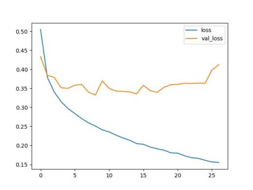
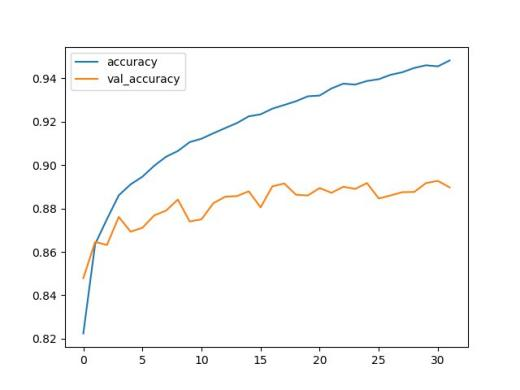

# Tensorflow-Telegram-Bot
Telegram Chatbot class which can be used as keras custom callback.
# How to Download
## from source
### 1.git clone https://github.com/Yeachan-Heo/Tensorflow-Telegram-Bot.git
### 2.python setup.py build
### 3.python setup.py install
## via pip
### 1.pip install Tensorflow-Telegram-Bot
# How to use
#### 1.create your Telegram bot and get it's token as explained in https://telegram.org/faq#bots  
#### 2.add your bot as your telegram friend  
#### 3.go to your code, add "from ttb import TelegramBotCallback" at the top 
#### 4.and add TelegramBotCallback(token="your token") to callbacks when calling Model.fit() method.
#### 5.run your code  
#### 6.start your bot  
#### 7.use command /help to learn some commands  
#### 8.enjoy your training  
#### 9.you're welcome XD  

<!DOCTYPE html>
<html>

 <head>

  <meta charset="utf-8"/>
<title>Exported Data</title>
  <meta content="width=device-width, initial-scale=1.0" name="viewport"/>

  <link href="css/style.css" rel="stylesheet"/>

  

 </head>

 <body onload="CheckLocation();">

  

   

    

     

ych_bot 
     

    

   

   

    

     

      

26 February 2020
      

     

     

      

History cleared
      

     

     

      

       

        

y
        

       

      

      

       

20:48
       

       

ych_bot 
       

       

hello, yeachan. TensorFlow Telegram Bot is just Started.
       

      

     

     

      

       

20:48
       

       

Hi, The model is Beginning Training.                           after this, you can get learning status via using some commands                           if you want to know more about that, use command <a href="" onclick="return ShowBotCommand(&quot;help&quot;)">/help</a>                           please enjoy your training
       

      

     

     

      

       

20:48
       

       

invalid command usage
       

      

     

     

      

       

20:49
       

       

<a href="" onclick="return ShowBotCommand(&quot;help&quot;)">/help</a>: shows this helpful message :D             <a href="" onclick="return ShowBotCommand(&quot;status&quot;)">/status</a>:                 usage:                     <a href="" onclick="return ShowBotCommand(&quot;status&quot;)">/status</a> arg1 arg2 arg3....: prints last value of arg1, arg2, arg3                     <a href="" onclick="return ShowBotCommand(&quot;status&quot;)">/status</a> all: prints last value of all arguments             <a href="" onclick="return ShowBotCommand(&quot;plot&quot;)">/plot</a>:                 usage:                     <a href="" onclick="return ShowBotCommand(&quot;plot&quot;)">/plot</a> arg1 arg2 arg3....: plots all value of arg1, arg2, arg3 in one figure                     <a href="" onclick="return ShowBotCommand(&quot;plot&quot;)">/plot</a> all: plots all value of all argument in one figure             <a href="" onclick="return ShowBotCommand(&quot;set&quot;)">/set</a>:                 usage:                     <a href="" onclick="return ShowBotCommand(&quot;set&quot;)">/set</a> lr: changes learning rate             if you can&apos;t get it, why don&apos;t you just try?
       

      

     

     

      

       

        

yH
        

       

      

      

       

20:49
       

       

yeachan Hue
       

       

<a href="" onclick="return ShowBotCommand(&quot;status&quot;)">/status</a> all
       

      

     

     

      

       

        

y
        

       

      

      

       

20:49
       

       

ych_bot 
       

       

loss:0.22736297063231467 accuracy:0.9146166443824768 val_loss:0.3432700324833393 val_accuracy:0.8823999762535095 epoch:11
       

      

     

     

      

       

        

yH
        

       

      

      

       

20:49
       

       

yeachan Hue
       

       

<a href="" onclick="return ShowBotCommand(&quot;status&quot;)">/status</a> loss val_loss
       

      

     

     

      

       

        

y
        

       

      

      

       

20:49
       

       

ych_bot 
       

       

loss:0.20499075312862794 val_loss:0.3357230696260929
       

      

     

     

      

       

        

yH
        

       

      

      

       

20:50
       

       

yeachan Hue
       

       

<a href="" onclick="return ShowBotCommand(&quot;status&quot;)">/status</a> accuracy val_accuracy
       

      

     

     

      

       

        

y
        

       

      

      

       

20:50
       

       

ych_bot 
       

       

accuracy:0.9316333532333374 val_accuracy:0.8859999775886536
       

      

     

     

      

       

        

yH
        

       

      

      

       

20:50
       

       

yeachan Hue
       

       

<a href="" onclick="return ShowBotCommand(&quot;plot&quot;)">/plot</a> loss val_loss
       

      

     

     

      

       

        

y
        

       

      

      

       

20:50
       

       

ych_bot 
       

       

drawing plot
       

      

     

     

      

       

20:50
       

       

        

       

      

     

     

      

       

20:50
       

       

here&apos;s your plot!
       

      

     

     

      

       

        

yH
        

       

      

      

       

20:50
       

       

yeachan Hue
       

       

<a href="" onclick="return ShowBotCommand(&quot;plot&quot;)">/plot</a> accuracy val_accuracy
       

      

     

     

      

       

        

y
        

       

      

      

       

20:51
       

       

ych_bot 
       

       

drawing plot
       

      

     

     

      

       

20:51
       

       

        

       

      

     

     

      

       

20:51
       

       

here&apos;s your plot!
       

      

     

    

   

  

 </body>

</html>
